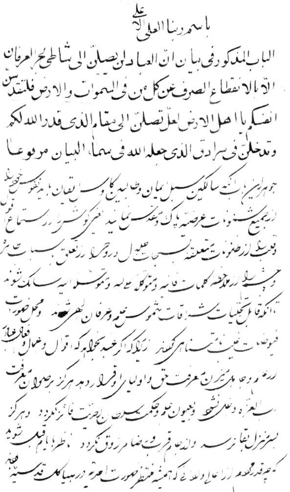

## Timeline

::: {.timeline}
- **May 1844** The Báb declares His Mission in Shíráz.
- **1844** The Báb's message reaches Bahá'u'lláh in Ṭihrán. He immediately accepts the message and arises to teach the Cause, becoming its foremost champion.
- **Early 1850** Ḥájí Mírzá Siyyid ʿAlí, the Báb's maternal uncle and the only father He had known since childhood, is executed among the Seven Martyrs of Ṭihrán. Two uncles survive him: Ḥájí Mírzá Siyyid Muhammad, the eldest, who would receive the Kitáb-i-Íqán, and Ḥájí Mírzá Siyyid Hasan-ʿAlí, the youngest.
- **9 July 1850** The Báb is executed in Tabríz, in His thirty-first year and the seventh of His ministry.
- **August–December 1852** Bahá'u'lláh is confined for four months in the Síyáh-Chál, an abandoned underground reservoir beneath Ṭihrán. There, in chains, He receives the first intimation of His own Revelation. However, the time is not yet right to divulge this secret and he keeps it concealed.
- **12 January 1853** The Holy Family is banished from Persia, Bahá'u'lláh departs Ṭihrán in midwinter with His family, including His nine-year-old son ʻAbdu'l-Bahá.
- **8 April 1853** They arrive in Baghdád, the Abode of Peace, which Bahá'u'lláh would designate the "City of God", and which the Qur'án alludes to as promising the faithful a "Dwelling of Peace with their Lord".
- **10 April 1854** Rather than contend with His half-brother and divide a community already in confusion, Bahá'u'lláh leaves alone and unannounced for the mountains of Kurdistán, under the name Darvísh Muḥammad.
- **19 March 1856** Bahá'u'lláh returns to Baghdád after two years and sets about reviving the Bábí community. His modest house in the Karkh quarter becomes a place of resort for Kurds, Persians, Arabs and Turks, for Muslims, Jews and Christians, for ʻulamá and nobility alike.
- **1858** The Hidden Words is revealed, composed as He walked the banks of the Tigris.
- **1856–1863** The Seven Valleys is revealed, His principal mystical work, describing the stages of the soul's journey toward its Creator.
- **1862** The Kitáb-i-Íqán is revealed within two days and two nights, in answer to questions from the maternal uncle of the Báb, Khál-i-Akbar.
- **22 April – 3 May 1863** Ordered to proceed to Constantinople, Bahá'u'lláh leaves His house and stays twelve days in the Najíbíyyih Garden — since known as the Garden of Riḍván — where He declares His Mission publicly for the first time, to a small group of companions.
:::

## Condition of the Bábí community

The Bábí community had suffered a serious blow due to the severe repression following the attempt
on the life of the King. Baghdád had been blessed by the teaching efforts of Ṭáhirih, but by the 
time Bahá'u'lláh arrived, He found among the inhabitants of the city no more than a single 
Bábí, and in Káẓimayn (a neighboring town) a mere handful who still professed their faith "in fear 
and obscurity." The Báb had been executed, Bahá'u'lláh Himself had been imprisoned and then banished, 
and the ablest of the believers had been killed. What remained was a community with no voice
it could trust to resolve its questions or tell it what its duty was. Shoghi Effendi writes that
it was sunk in a distress that "stifled their spirit, confused their minds and strained to
the utmost their loyalty."

In Qazvín the community had split into four mutually hostile factions, and in time no fewer 
than twenty-five men would claim to be the Promised One foretold by the Báb.

::: {.witness}
> The fire of the Cause of God had been well-nigh quenched in every place. I could detect no trace
> of warmth anywhere.
>
> [Nabíl, travelling through Khurásán]{.attrib}
:::

Such was the "waywardness and folly" of the community that, on His release from prison, Bahá'u'lláh 
declared that His first decision was "to arise … and undertake, with the utmost vigor, 
the task of regenerating this people."

## The first internal crisis

The danger of the early Baghdád years was not from external opposition. The external enemies were,
for the moment, quiescent — exhausted by the bloodshed and restrained by orders from 
the Grand Vizir. The crisis that overshadowed the first years in ʻIráq was of another kind, 
"purely internal in character," and "occasioned solely by the acts, the ambitions and 
follies of those who were numbered among His recognized fellow-disciples."

Its central figure was Bahá'u'lláh's half brother, Mírzá Yaḥyá, who the Báb nominated as the 
figurehead of the community, who prided himself on his titles such as Ṣubḥ-i-Azal (Morning 
of Eternity) while living in hiding under an assumed name as a cotton-seller, "closeted most of 
the time in his house." Behind him stood Siyyid Muḥammad of Iṣfahán, whom Bahá'u'lláh 
later stigmatized as the "source of envy and the quintessence of mischief," and whose 
hold over Yaḥyá ʻAbdu'l-Bahá likened to that of "the sucking child" upon the "much-prized 
breast" of its mother.

As Bahá'u'lláh's prestige rose, the jealousy of Mírzá Yaḥyá and Siyyid Muḥammad grew and they began
an underground campaign to undermine Bahá'u'lláh and by their conduct were bringing the public image
of the Faith into disrepute. Insinuations circulated that Bahá'u'lláh was a usurper and a
subverter of the Báb's laws, His letters and commentaries were covertly misrepresented. 
An attempt on His life was also set afoot, though it ultimately came to nothing. To the believers of those days Bahá'u'lláh wrote:

::: {.witness}
> The days of tests are now come. Oceans of dissension and tribulation are surging, and the Banners
> of Doubt are, in every nook and corner, occupied in stirring up mischief and in leading men to
> perdition.… God, however, will establish His Faith, and manifest His light albeit the stirrers of
> sedition abhor it.
>
> [Bahá'u'lláh]{.attrib}
:::

## Withdrawal of Bahá'u'lláh

Discerning, as He says in the Íqán, "the signs of impending events," He decided to withdraw before they
arrived. On 10 April 1854, without telling anyone, He left Baghdád with a single attendant, who was
killed by thieves shortly afterwards. From then on He was alone.

Coarsely clad, carrying nothing but an alms-bowl and a change of clothes, and giving His name as
Darvísh Muḥammad, He lived for a time on the mountain of Sar-Galú in Kurdistán, in a stone shelter that the
peasants of the region visited only twice a year, at sowing and at harvest.

::: {.witness}
> The one object of Our retirement was to avoid becoming a subject of discord among the faithful, a
> source of disturbance unto Our companions, the means of injury to any soul, or the cause of
> sorrow to any heart. … Our withdrawal contemplated no return, and Our separation hoped for no
> reunion.
>
> [Bahá'u'lláh, *Kitáb-i-Íqán* [¶278](read.qmd#p278)]{.attrib}
:::

Discovered at last through a specimen of His penmanship, He was drawn into the seminary at
Sulaymáníyyih, where He resolved the doctors' perplexities over Ibn ʻArabí's *Futúḥát-i-Makkíyyih*
— a book He told them He had never seen — and, at their request, dictated two thousand verses in
the exacting metre of Ibn-i-Fáriḍ, permitting them to keep one hundred and twenty-seven of them.
These are known as the [Ode of the Dove](https://bahai-library.com/hatcher_bahaullah_ode_dove).

::: {.witness}
> In a short time, Kurdistán was magnetized with His love. During this period Bahá'u'lláh lived in
> poverty. His garments were those of the poor and needy. His food was that of the indigent and
> lowly. An atmosphere of majesty haloed Him as the sun at midday.
>
> [ʻAbdu'l-Bahá]{.attrib}
:::

## Return and reinvigoration of the Bábí community

The two years of absence especially challenging to the Bábí community. Mírzá Yaḥyá directed a campaign by
letter to discredit Bahá'u'lláh, sent a man to murder Dayyán, and ordered the secret killing of the
Báb's cousin Mírzá ʻAlí-Akbar. Siyyid Muḥammad's band of ruffians robbed pilgrims in Karbilá and
stripped the shrine of the Imám Ḥusayn. Out of shame, Bábís hardly dared appear in public.

Bahá'u'lláh returned to Baghdád on 19 March 1856,
exactly two lunar years after He had left.

::: {.witness}
> But for My recognition of the fact that the blessed Cause of the Primal Point was on the verge of
> being completely obliterated, and all the sacred blood poured out in the path of God would have
> been shed in vain, I would in no wise have consented to return to the people of the Bayán.
>
> [Bahá'u'lláh, to Shaykh Sulṭán, as reported by Nabíl]{.attrib}
:::

What He found He described as "no more than a handful of souls, faint and dispirited, nay utterly
lost and dead. The Cause of God had ceased to be on any one's lips, nor was any heart receptive to
its message." For a time His sadness kept Him at home. Yet this return, Shoghi Effendi writes,
marks the turning point: "The tide of the fortunes of the Faith, having reached its lowest ebb, was
now beginning to surge back." In the seven years that followed, a re-arisen community took shape
around a fixed and accessible centre — something the Faith had not possessed since its first three
years.

During this time the community grew in number and in reputation. Through Bahá'u'lláh's guidance the
character and conduct of the community improved and He succeeded in establishing a high standard of 
rectitude of conduct, a standard to which souls joyously assisted each other to acquiesce.

::: {.witness}
> We exhorted all men … and forbade them to engage in sedition, quarrels, disputes or conflict. As
> a result of this, and by the grace of God, waywardness and folly were changed into piety and
> understanding, and weapons of war converted into instruments of peace.
>
> [Bahá'u'lláh]{.attrib}
:::

## Flow of visitors from all walks of life

The house of Sulaymán-i-Ghannám in the Karkh quarter was an extremely modest residence, known then
simply as "the house of Mírzá Músá, the Bábí," and later designated the Bayt-i-Aʻẓam, the Most
Great House. It became the focal centre for a great number of seekers, visitors and pilgrims.

Ṣúfí shaykhs of the Qádiríyyih and Khálidíyyih orders came from Sulaymáníyyih with the name
Darvísh Muḥammad on their lips. The Muftí of Baghdád, Ibn-i-Álúsí, and other divines of the city
came to test Him and enrolled among His admirers. Government officials came, and Persian princes
living in exile, and Persian Bábís whose only object was to attain His presence — among them four
of the Báb's cousins and His maternal uncle Ḥájí Mírzá Siyyid Muḥammad. Colonel Sir Arnold Burrowes
Kemball, the British consul-general, offered Him the protection of British citizenship and
undertook to carry any message He wished to Queen Victoria, an offer which Bahá'u'lláh declined. 
In His last year in the city the governor, Námiq Páshá, came to pay his own tribute. The house
served, too, as a sanctuary for those seeking redress against the Persian consul. The visitors, 
Shoghi Effendi writes, ranged "from the haughtiest prince to the meanest beggar."

::: {.witness}
> Low-roofed, it yet seemed to reach to the stars, and though it boasted but a single couch,
> fashioned from the branches of palms, whereon He Who is the King of Names was wont to sit, it
> drew to itself, even as a loadstone, the hearts of the princes.
>
> [Nabíl, on the reception room of the Most Great House]{.attrib}
:::

::: {.witness}
> I know not how to explain it. Were all the sorrows of the world to be crowded into my heart they
> would, I feel, all vanish, when in the presence of Bahá'u'lláh. It is as if I had entered
> Paradise itself.
>
> [Zaynu'l-ʻÁbidín Khán, the Fakhru'd-Dawlih]{.attrib}
:::

## Expansion of literature

Bahá'u'lláh described the verses of these years as "a copious rain." Nabíl, living in Baghdád at
the time, testified that in the first two years after the return the unrecorded verses that
streamed from His lips averaged, in a single day and night, the equivalent of the Qur'án. A great
proportion of this was deliberately destroyed. By His own order, hundreds of thousands of verses, mostly
in His own hand, were obliterated and cast into the river. When His amanuensis hesitated to do it,
He reassured him — "None is to be found at this time worthy to hear these melodies."

Some of the works which survive from this period include: 

- The **[Kitáb-i-Íqán](https://www.bahai.org/library/authoritative-texts/bahaullah/kitab-i-iqan)** (1862)
- The **[Hidden Words](https://www.bahai.org/library/authoritative-texts/bahaullah/hidden-words)** (1857-8), revealed as He paced the banks of the Tigris, and originally
  designated the Hidden Book of Fáṭimih.
- The **[Seven Valleys](https://www.bahai.org/library/authoritative-texts/bahaullah/call-divine-beloved/4#893325872)** (circa 1856-1863), His greatest mystical composition, written in answer to the questions of
  Shaykh Muḥyi'd-Dín, the Qáḍí of Khániqayn.
- The **[Four Valleys](https://www.bahai.org/library/authoritative-texts/bahaullah/call-divine-beloved/9#545908212)**, addressed to Shaykh ʻAbdu'r-Raḥmán-i-Karkúkí, one of the Kurdish leaders
  who had known Him as Darvísh Muḥammad.
- The **[Tablet of the Holy Mariner](https://www.bahai.org/r/960231995)**, the **[Ode of the Dove](https://bahai-library.com/hatcher_bahaullah_ode_dove)**, the **[Tablet of Patience](https://bahai-library.com/bahaullah_surih_sabr_fananapazir)**, the **[Gems of Divine Mysteries](https://www.bahai.org/library/authoritative-texts/bahaullah/gems-divine-mysteries)**, 
and a host of commentaries, odes and prayers.

## The three maternal uncles of the Báb

The Báb's mother had three brothers, Shíráz merchants, who between them stood in place of the
father He lost as a child.

- **Ḥájí Mírzá Siyyid ʻAlí**, *Khál-i-Aʻẓam* (the Great Uncle), who raised Him after His father's
  death, and who refused to recant and was martyred among the Seven Martyrs of Ṭihrán in early
  1850, some months before his Nephew.
- **Ḥájí Mírzá Siyyid Muḥammad**, *Khál-i-Akbar* (the Greater Uncle), the eldest, who admired his
  Nephew but could not reconcile the traditions with His claim. He put his questions in writing
  while visiting Karbilá, and received the Kitáb-i-Íqán in reply. He is the brother and friend the
  Book addresses throughout, and he is never named in it.
- **Ḥájí Mírzá Siyyid Ḥasan-ʻAlí**, *Khál-i-Aṣghar* (the Lesser Uncle), the youngest, who was with
  his brother on that visit to Karbilá.

## Questions submitted by Ḥájí Mírzá Siyyid Muḥammad 
The Kitáb-i-Íqán was revealed in answer to questions addressed to Bahá'u'lláh from the as yet
unconverted maternal uncle of the Báb, Ḥájí Mírzá Siyyid Muḥammad. They have been summarized 
into four categories as follows:

::: {.questions-list}
1. **The Day of Resurrection.** Is there to be a corporeal resurrection? The world is replete
   with injustice. How are the just to be requited and the unjust punished?
2. **The twelfth Imám** was born at a certain time and lives on. There are traditions, all
   supporting the belief. How can this be explained?
3. **Interpretation of the holy texts.** This Cause does not seem to conform to the beliefs held
   throughout the years. One cannot ignore the literal meaning of the holy texts and scriptures.
   How can this be explained?
4. **Certain events**, according to the traditions that have come down from the Imáms, must occur
   at the advent of the Qá'im. Some of these are mentioned. But none of these has happened. How
   can this be explained?
:::

The response was revealed by Bahá'u'lláh in two days and two nights. It was originally known as 
Risáliy-i-Khál (letter to the uncle) and later named Kitáb-i-Íqan (Book of Certitude)
by Bahá'u'lláh Himself. The original copy of the Book was transcribed by 'Abdu'l-Bahá at
the age of eighteen. The Book enabled the uncle as well as the majority of the family of 
the Báb to recognize the station and revelation of the Báb. They later also recognized Bahá'u'lláh. 

::: {.manuscript}
{fig-alt="A page of Arabic and Persian manuscript in a fine nastaʻlíq hand, headed by the invocation in the name of our Lord, the Exalted, the Most High."}
:::

::: {.source-note}
This account follows Shoghi Effendi's narrative in *God Passes By* — chiefly
[chapter VII](https://www.bahai.org/library/authoritative-texts/shoghi-effendi/god-passes-by/9),
[chapter VIII](https://www.bahai.org/library/authoritative-texts/shoghi-effendi/god-passes-by/10)
and [chapter IX](https://www.bahai.org/library/authoritative-texts/shoghi-effendi/god-passes-by/11).
Dates are as given there.
:::
