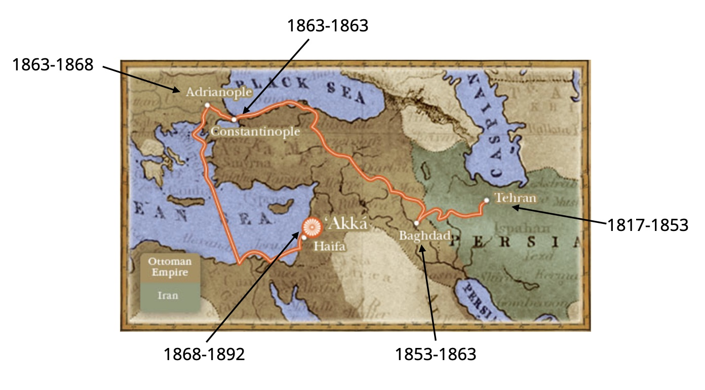

##  {.divider}

::: {.kicker}
Part One
:::

::: {.divider-title}
Welcome
:::

---

## Introductions

::: {.incremental}
- Your name
- Where you're from
- Something you're looking forward to this year
- What do you hope to **get** from this space?
- What do you hope to **give** to this space?
:::

---

## Goals of the study

::: {.incremental}
1. To strengthen the **habit of reading the Writings** by yourself
2. To advance in your understanding of **fundamental Bahá'í beliefs**, and how to explain them to
   others
3. To experience the **joy of reading** the Sacred Writings
:::

---

## Format of the study

::: {.smaller}
Each session there will be time for:
:::

::: {.incremental .smaller}
- Understanding and reflecting on the **paragraphs assigned for that week**, and selected
  supplementary material related to the themes of those paragraphs
- Exploring any **questions** that came up during your reading or during the last week's discussion
- Further resources are posted for anyone who wants to follow a topic further. They are **not
  required** reading.
:::

---

## Group norms and expectations

::: {.incremental .smaller}
- To contribute to an **open and welcoming environment**, and to respect everyone in the group
- To come having **read the paragraphs**, having made an honest attempt to engage with the text and
  reflect on its meaning
- To **ask the questions you actually have**, and to respond to what others say
:::

::: {.fragment}
::: {.label}
And
:::
You are **not expected to understand everything** we read. That is why we study together.
:::

---

##  {.divider}

::: {.kicker}
Part Two
:::

::: {.divider-title}
What is the Book of Certitude?
:::

---

## A Book revealed in answer to a question

::: {.smaller}
The **Kitáb-i-Íqán** — *the Book of Certitude* — was revealed by Bahá'u'lláh in **Baghdád in 1862**,
in response to questions posed by one of the maternal uncles of the Báb.

It was translated by Shoghi Effendi and first published in English in **1931**.
:::

::: {.fragment}
> Revealed within the space of two days and two nights, in the closing years of that period
> (1278 A.H.–1862 A.D.). It was written in fulfillment of the prophecy of the Báb, Who had
> specifically stated that the Promised One would complete the text of the unfinished Persian Bayán.
>
> [Shoghi Effendi]{.attrib}
:::

---

## The manuscript

::: {.incremental}
- Over **two hundred pages**, revealed in the space of **two days and two nights**
- Revealed in **Persian**, with Arabic quotations, verses from the Qur'án and traditions of Islám
- Transcribed by **ʻAbdu'l-Bahá**, then **eighteen years of age**, in His own hand
- In the margins of several pages, **Bahá'u'lláh** made corrections in His own hand
:::

---

##  {.divider}

::: {.kicker}
Part Three
:::

::: {.divider-title}
Where it comes from
:::

::: {.divider-sub}
Baghdád, 1853–1863
:::

---

## The life of Bahá'u'lláh {.center}

::: {.map}

[Bahá'u'lláh's successive places of exile, with the years He spent in each]{.map-caption}
:::

---

## Before Baghdád

::: {.incremental .smaller}
- **May 1844** — the Báb declares His Mission in Shíráz
- **1844** — the message reaches Bahá'u'lláh in Ṭihrán. He accepts it at once and becomes the
  Cause's foremost champion
- **Early 1850** — Khál-i-Aʻẓam, the Báb's maternal uncle, is executed among the **Seven Martyrs of
  Ṭihrán**
- **9 July 1850** — the Báb is executed in Tabríz, in His thirty-first year and the seventh of His
  ministry
- **August–December 1852** — four months in the **Síyáh-Chál**, an abandoned underground reservoir
  beneath Ṭihrán. There, in chains, Bahá'u'lláh receives the first intimation of His own
  Revelation — and keeps it concealed
:::

---

## Into exile

::: {.incremental .smaller}
- **12 January 1853** — banished from Persia, He departs Ṭihrán in midwinter with His family,
  including His nine-year-old son ʻAbdu'l-Bahá
- **8 April 1853** — they arrive in **Baghdád**, the Abode of Peace, which Bahá'u'lláh would
  designate the "City of God"
- **10 April 1854** — rather than contend with His half-brother and divide a community already in
  confusion, He leaves alone and unannounced for the mountains of **Kurdistán**
- **19 March 1856** — He returns, and sets about reviving the Bábí community
:::

---

## The years of the Book

::: {.incremental .smaller}
- **1858** — the **Hidden Words**, composed as He paced the banks of the Tigris
- **1856–1863** — the **Seven Valleys**, His principal mystical work
- **1862** — the **Kitáb-i-Íqán**, revealed in two days and two nights
- **22 April – 3 May 1863** — ordered to Constantinople, He stays twelve days in the Najíbíyyih
  Garden — now the **Garden of Riḍván** — and declares His Mission publicly for the first time
:::

::: {.fragment .smaller}
The Íqán belongs to the **last months** before that declaration.
:::

---

## What He found in Baghdád

::: {.smaller}
The community had suffered a serious blow from the repression that followed the attempt on the
life of the Sháh. Baghdád had been blessed by the teaching of Ṭáhirih — yet Bahá'u'lláh found
among the inhabitants **no more than a single Bábí**, and in Káẓimayn a mere handful who still
professed their faith "in fear and obscurity."

The Báb had been executed. Bahá'u'lláh had been imprisoned and banished. The ablest of the
believers had been killed.
:::

::: {.fragment}
> The fire of the Cause of God had been well-nigh quenched in every place. I could detect no trace
> of warmth anywhere.
>
> [Nabíl, travelling through Khurásán]{.attrib}
:::

---

## A community without a voice

::: {.incremental .smaller}
- No voice it could trust **to resolve its questions** or tell it what its duty was — sunk, Shoghi
  Effendi writes, in a distress that "stifled their spirit, confused their minds and strained to
  the utmost their loyalty"
- In **Qazvín**, the community had split into four mutually hostile factions
- In time **twenty-five men** would claim to be the Promised One foretold by the Báb
:::

::: {.fragment .smaller}
Such was the "waywardness and folly" of the community that, on His release from prison,
Bahá'u'lláh's first decision was "to arise … and undertake, with the utmost vigor, the task of
**regenerating this people**."
:::

---

## The first crisis was internal

::: {.smaller}
The danger of the early Baghdád years was not external opposition. The enemies of the Faith were,
for the moment, quiescent — exhausted by the bloodshed and restrained by orders from the Grand
Vizir.
:::

::: {.fragment .smaller}
The crisis that overshadowed those first years in ʻIráq was "**purely internal in character**," and
"occasioned solely by the acts, the ambitions and follies of those who were numbered among His
recognized fellow-disciples."
:::

::: {.fragment .smaller}
Its central figure was Bahá'u'lláh's half-brother **Mírzá Yaḥyá**, whom the Báb had nominated as
figurehead of the community — prizing titles such as *Ṣubḥ-i-Azal* (Morning of Eternity) while
living in hiding under an assumed name as a cotton-seller, "closeted most of the time in his
house." Behind him stood **Siyyid Muḥammad of Iṣfahán**, whom Bahá'u'lláh later stigmatized as the
"source of envy and the quintessence of mischief."
:::

---

## What the campaign looked like

::: {.incremental .smaller}
- Insinuations that Bahá'u'lláh was a **usurper** and a subverter of the Báb's laws
- His letters and commentaries **covertly misrepresented**
- Conduct that brought the public image of the Faith into disrepute
- An attempt on His life set afoot, though it came to nothing
:::

::: {.fragment}
> The days of tests are now come. Oceans of dissension and tribulation are surging.… God, however,
> will establish His Faith, and manifest His light albeit the stirrers of sedition abhor it.
>
> [Bahá'u'lláh]{.attrib}
:::

---

## The withdrawal

::: {.smaller}
Discerning, as He says in the Íqán, "the signs of impending events," He decided to withdraw before
they arrived. On **10 April 1854**, without telling anyone, He left Baghdád with a single
attendant — who was killed by thieves shortly afterwards. From then on He was **alone**.

Coarsely clad, carrying nothing but an alms-bowl and a change of clothes, and giving His name as
**Darvísh Muḥammad**, He lived for a time on the mountain of **Sar-Galú**, in a stone shelter the
peasants visited only twice a year, at sowing and at harvest.
:::

---

##  {.center}

> The one object of Our retirement was to avoid becoming a subject of discord among the faithful, a
> source of disturbance unto Our companions, the means of injury to any soul, or the cause of
> sorrow to any heart. … Our withdrawal contemplated no return, and Our separation hoped for no
> reunion.
>
> [Bahá'u'lláh, Kitáb-i-Íqán ¶278]{.attrib}

---

## Kurdistán

::: {.smaller}
Discovered at last through a specimen of **His penmanship**, He was drawn into the seminary at
Sulaymáníyyih — where He resolved the doctors' perplexities over Ibn ʻArabí's
*Futúḥát-i-Makkíyyih*, a book He told them He had never seen, and at their request dictated **two
thousand verses** in the exacting metre of Ibn-i-Fáriḍ, permitting them to keep one hundred and
twenty-seven of them. These are known as the **Ode of the Dove**.
:::

::: {.fragment}
> In a short time, Kurdistán was magnetized with His love. During this period Bahá'u'lláh lived in
> poverty. His garments were those of the poor and needy. His food was that of the indigent and
> lowly. An atmosphere of majesty haloed Him as the sun at midday.
>
> [ʻAbdu'l-Bahá]{.attrib}
:::

---

## Two years away

::: {.smaller}
The absence was especially hard on the community. Mírzá Yaḥyá directed a campaign by letter to
discredit Bahá'u'lláh, sent a man to murder Dayyán, and ordered the secret killing of the Báb's
cousin Mírzá ʻAlí-Akbar. Siyyid Muḥammad's band of ruffians robbed pilgrims in Karbilá and
stripped the shrine of the Imám Ḥusayn. Out of shame, Bábís hardly dared appear in public.
:::

::: {.fragment}
> But for My recognition of the fact that the blessed Cause of the Primal Point was on the verge of
> being completely obliterated, and all the sacred blood poured out in the path of God would have
> been shed in vain, I would in no wise have consented to return to the people of the Bayán.
>
> [Bahá'u'lláh, to Shaykh Sulṭán]{.attrib}
:::

---

## The turning point

::: {.smaller}
He returned on **19 March 1856**, exactly two lunar years after He had left. What He found He
described as "no more than a handful of souls, faint and dispirited, nay utterly lost and dead.
The Cause of God had ceased to be on any one's lips, nor was any heart receptive to its message."
:::

::: {.fragment}
> The tide of the fortunes of the Faith, having reached its **lowest ebb**, was now beginning to
> **surge back**.
>
> [Shoghi Effendi]{.attrib}
:::

::: {.fragment .smaller}
In the seven years that followed, a re-arisen community took shape around a fixed and accessible
centre — something the Faith had not possessed since its first three years.
:::

---

## A community remade

::: {.smaller}
The community grew in number and in reputation. Through Bahá'u'lláh's guidance its character and
conduct improved, and He established a high standard of **rectitude of conduct** — a standard to
which souls joyously assisted each other to acquiesce.
:::

::: {.fragment}
> We exhorted all men … and forbade them to engage in sedition, quarrels, disputes or conflict. As
> a result of this, and by the grace of God, waywardness and folly were changed into piety and
> understanding, and **weapons of war converted into instruments of peace**.
>
> [Bahá'u'lláh]{.attrib}
:::

---

## The house in the Karkh quarter

::: {.smaller}
An extremely modest residence, known then simply as "the house of Mírzá Músá, the Bábí," and later
designated the **Bayt-i-Aʻẓam**, the Most Great House. It became the focal centre for a great
number of seekers, visitors and pilgrims.
:::

::: {.incremental .smaller}
- **Ṣúfí shaykhs** of the Qádiríyyih and Khálidíyyih orders, come from Sulaymáníyyih with the name
  Darvísh Muḥammad on their lips
- The **Muftí of Baghdád**, Ibn-i-Álúsí, and other divines of the city, who came to test Him and
  enrolled among His admirers
- Government officials, Persian princes in exile, and Bábís whose only object was to attain His
  presence — among them four of the Báb's cousins and **his maternal uncle**
- **Colonel Sir Arnold Burrowes Kemball**, the British consul-general, who offered Him British
  citizenship and to carry any message to Queen Victoria — an offer He declined
:::

---

##  {.center}

> Low-roofed, it yet seemed to reach to the stars, and though it boasted but a single couch,
> fashioned from the branches of palms, whereon He Who is the King of Names was wont to sit, it
> drew to itself, even as a loadstone, the hearts of the princes.
>
> [Nabíl, on the reception room of the Most Great House]{.attrib}

::: {.fragment}
> I know not how to explain it. Were all the sorrows of the world to be crowded into my heart they
> would, I feel, all vanish, when in the presence of Bahá'u'lláh. It is as if I had entered
> Paradise itself.
>
> [Zaynu'l-ʻÁbidín Khán, the Fakhru'd-Dawlih]{.attrib}
:::

---

## "A copious rain"

::: {.smaller}
Nabíl, living in Baghdád at the time, testified that in the first two years after the return the
unrecorded verses that streamed from His lips averaged, **in a single day and night, the equivalent
of the Qur'án**.
:::

::: {.fragment .smaller}
A great proportion was deliberately destroyed. By His own order, hundreds of thousands of verses,
mostly in His own hand, were obliterated and cast into the river. When His amanuensis hesitated,
He reassured him:
:::

::: {.fragment}
> None is to be found at this time worthy to hear these melodies.
>
> [Bahá'u'lláh]{.attrib}
:::

---

## What survives from Baghdád

::: {.incremental .smaller}
- The **Kitáb-i-Íqán** (1862)
- The **Hidden Words** (1857–8), originally designated the Hidden Book of Fáṭimih
- The **Seven Valleys** (c. 1856–1863), written in answer to the questions of Shaykh Muḥyi'd-Dín,
  the Qáḍí of Khániqayn
- The **Four Valleys**, addressed to Shaykh ʻAbdu'r-Raḥmán-i-Karkúkí — one of the Kurdish leaders
  who had known Him as Darvísh Muḥammad
- The **Tablet of the Holy Mariner**, the **Ode of the Dove**, the **Tablet of Patience**, the
  **Gems of Divine Mysteries**, and a host of commentaries, odes and prayers
:::

---

##  {.divider}

::: {.kicker}
Part Four
:::

::: {.divider-title}
The occasion
:::

::: {.divider-sub}
One man's questions, and the Book that answered them
:::

---

## The three maternal uncles of the Báb

::: {.smaller}
Brothers of His mother, Fatima-Begum.
:::

::: {.tiles}
::: {.tile .marked}
[Hájí Mírzá Siyyid Muḥammad]{.tile-name}
[Khál-i-Akbar · the Greater Uncle]{.tile-epithet}
The eldest of the three, and **the recipient of the Íqán**.
:::

::: {.tile}
[Hájí Mírzá Siyyid ʻAlí]{.tile-name}
[Khál-i-Aʻẓam · the Greatest Uncle]{.tile-epithet}
The middle brother. Raised and cared for the Báb from childhood after His father's passing.
Recognized His station at once and was the first to declare his faith after the Letters of the
Living. Martyred as one of the Seven Martyrs of Ṭihrán.
:::

::: {.tile}
[Hájí Mírzá Siyyid Ḥasan ʻAlí]{.tile-name}
[Khál-i-Aṣghar · the younger uncle]{.tile-epithet}
The youngest of the three brothers.
:::
:::

---

## The admirer who could not believe

::: {.smaller}
Before His declaration, the Báb was in **Bushihr**, occupied in business with His three uncles. He
left for **Shíráz** accompanied by Khál-i-Aʻẓam, and declared His Mission there in **1844**.

Khál-i-Akbar continued to run the family business at Bushihr. Travelling to Mecca and returning,
the Báb stayed at this uncle's home — and the uncle witnessed a great transformation of spirit in
his Nephew.
:::

::: {.fragment}
> [I am] pleased to be in the presence of his Nephew Whose bountiful soul is the source of
> felicity for the people of the world and the next.
>
> [Khál-i-Akbar, writing to the Báb's mother]{.attrib}
:::

::: {.fragment .smaller}
And yet he **never accepted Him as the Promised One of Islám** — not until he met Bahá'u'lláh in
Baghdád in 1862. Several believers had tried to dispel his doubts, without success: he did not
believe his Nephew had fulfilled certain Islamic traditions.
:::

---

## The journey to Baghdád

::: {.incremental .smaller}
- **1850** — the martyrdom of the Báb and of His uncle Khál-i-Aʻẓam brings immense grief to the
  family. Fatima-Begum, unable to remain in Shíráz, takes up residence in **Karbilá**.
- **Agha Mirza Nurud-Din**, of the Afnán family, in a series of discussions persuades Khál-i-Akbar
  to travel to Baghdád, meet Bahá'u'lláh, and put his questions to Him directly.
- He invites his younger brother to accompany him on pilgrimage to the Shrines of Iraq — but does
  not tell him the real purpose until they arrive. His brother, on hearing it, speaks very harshly
  to him.
- So they visit the Shrines first. It is on the **return to Baghdád** that he is taken to the house
  of Bahá'u'lláh, where he attains His presence **alone**.
:::

---

## "Bring me your questions"

::: {.smaller}
Overwhelmed and uplifted as he sat in His presence, Khál-i-Akbar asked Bahá'u'lláh to clarify the
truth of the Báb's Message — presuming in his mind that certain traditions of Islám concerning the
Promised Qá'im had not been fulfilled by his Nephew.

Bahá'u'lláh readily consented, and bade him **go home, consider carefully, and make a list of the
questions that had puzzled him** together with all the Islamic traditions that had bred his doubts.
:::

::: {.fragment .smaller}
Afterwards the uncle wrote to his son of his wonder — and of his regret that people who miss being
in Bahá'u'lláh's bounteous presence are at a grievous loss.
:::

---

## The four questions

The questions were written on two sheets in his own hand, under four headings — all dealing with
the coming of the Promised Qá'im.

::: {.questions}
1. **The Day of Resurrection.** Is there to be a corporeal resurrection? The world is replete with
   injustice — how are the just to be requited and the unjust punished?
2. **The twelfth Imám** was born at a certain time and lives on. There are traditions, all supporting
   the belief. How can this be explained?
3. **Interpretation of the holy texts.** This Cause does not seem to conform to the beliefs held
   throughout the years. One cannot ignore the literal meaning of the holy texts and scriptures.
4. **Certain events** must occur at the advent of the Qá'im, according to the traditions handed down
   from the Imáms. But none of these has happened. How can this be explained?
:::

---

## Two days and two nights

::: {.smaller}
Within two days and two nights the Kitáb-i-Íqán was revealed, answering all of his questions — and
solving, along the way, a great many misunderstood and misinterpreted questions belonging to
**all** religions.
:::

::: {.fragment .smaller}
The Book dispelled every doubt Khál-i-Akbar had harboured. He reached the stage of **certitude**
and recognized the station of the Báb. Later he also accepted Bahá'u'lláh as *"Him Whom God shall
make manifest"* — as was confirmed in his will.
:::

::: {.fragment}
::: {.label}
The point
:::
::: {.smaller}
A book written to answer one man's honest doubts turned out to answer the doubts of everyone who
would come after him.
:::
:::

---

##  {.divider}

::: {.kicker}
Part Five
:::

::: {.divider-title}
Why should we study it?
:::

---

##  {.center}

> In fact, all the Scriptures and the mysteries thereof are condensed into this brief account.
> So much so, that were a person to ponder it a while in his heart, he would discover from all
> that hath been said the mysteries of the Words of God, and would apprehend the meaning of
> whatever hath been manifested by that ideal King.
>
> [Bahá'u'lláh]{.attrib}

---

## Shoghi Effendi on the Íqán

> The Iqan is the most important book written on the spiritual significance of the Cause. I do
> not believe any person can consider himself well versed in the teachings unless he has studied
> it thoroughly.

::: {.fragment}
> The book is so important that the most minute detail is worthy of consideration.
:::

::: {.fragment}
> Of special importance is the Book of the Iqán which explains the attitude of the Cause towards
> the prophets of God and their mission in the history of society.
:::

---

## A key, not a conclusion

> The Sacred Books are full of allusions to this new dispensation. In the book of Iqán,
> Bahá'u'lláh gives the **key-note** and explains some of the outstanding passages hoping that
> the friends will **continue to study the Sacred Books by themselves** and unfold the mysteries
> found therein.
>
> [Shoghi Effendi]{.attrib}

::: {.fragment .smaller}
> The one who ponders over that book and grasps its full significance will obtain a clear insight
> into the old scriptures and appreciate the true mission of the Báb and Bahá'u'lláh.
>
> [Shoghi Effendi]{.attrib}
:::

---

##  {.divider}

::: {.kicker}
Part Six
:::

::: {.divider-title}
What is inside
:::

::: {.divider-sub}
Shoghi Effendi's overview
:::

---

## Its place in the Writings

> **Foremost** among the priceless treasures cast forth from the billowing ocean of Bahá'u'lláh's
> Revelation ranks the Kitáb-i-Íqán.

::: {.fragment}
> A model of Persian prose, of a style at once original, chaste and vigorous, and remarkably
> lucid, both cogent in argument and matchless in its irresistible eloquence.
:::

::: {.fragment}
> Setting forth in outline the Grand Redemptive Scheme of God, [it] occupies a position
> **unequalled by any work in the entire range of Bahá'í literature, except the Kitáb-i-Aqdas**,
> Bahá'u'lláh's Most Holy Book.
:::

::: {.fragment .tiny}
Revealed on the eve of the declaration of His Mission, it proffered to mankind the "Choice Sealed
Wine," whose seal is of "musk," and broke the "seals" of the "Book" referred to by Daniel.
:::

---

## Within a compass of two hundred pages

::: {.incremental .tight .dense}
- **Proclaims** the existence and oneness of a personal God — unknowable, inaccessible, the source
  of all Revelation, eternal, omniscient, omnipresent and almighty
- **Asserts** the relativity of religious truth and the continuity of Divine Revelation
- **Affirms** the unity of the Prophets, the universality of their Message, the identity of their
  fundamental teachings, the sanctity of their scriptures, and the **twofold character of their stations**
- **Denounces** the blindness and perversity of the divines and doctors of every age
- **Cites and elucidates** the allegorical passages of the New Testament, the abstruse verses of
  the Qur'án, and the cryptic Muḥammadan traditions
- **Enumerates** the essential prerequisites for the attainment by every true seeker of the object
  of his quest
- **Demonstrates** the validity, the sublimity and significance of the Báb's Revelation
- **Unfolds** the meaning of such symbolic terms as "Return," "Resurrection," "Seal of the
  Prophets" and "Day of Judgment"
- **Distinguishes** between the three stages of Divine Revelation
- **Expatiates** upon the glories and wonders of the "City of God"
:::

---

## The claim {.center}

> Well may it be claimed that of all the books revealed by the Author of the Bahá'í Revelation,
> **this Book alone**, by sweeping away the age-long barriers that have so insurmountably separated
> the great religions of the world, has laid down a broad and unassailable foundation for the
> complete and permanent reconciliation of their followers.
>
> [Shoghi Effendi]{.attrib}

---

## The road ahead

::: {.smaller}
**Thirteen sessions. Paragraphs 1 through 290.** From the conditions of the true seeker, through
the symbolic language of "oppression" and "sun, moon and stars," through resurrection and return
and the twofold station of the Manifestations, to the proofs of the Revelation of the Báb.
:::

::: {.fragment .smaller}
For next week: **paragraphs 1–23**.
:::

::: {.fragment}
[See the full schedule →](../schedule.qmd){.smaller}
:::

---

##  {.finale}

> They that tread the path of faith, they that thirst for the wine of certitude, must cleanse
> themselves of all that is earthly.
>
> [Bahá'u'lláh, Kitáb-i-Íqán ¶2]{.attrib}
