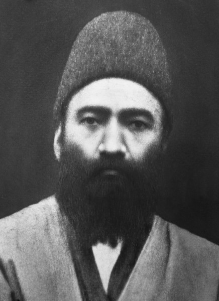

## Introductions

::: {.incremental}
- Your name
- Where you're from
- Something you're looking forward to this year
- What do you hope to **get** from this space?
- What do you hope to **give** to this space?
:::

---

## Turn to your neighbour

::: {.incremental}
- With the person next to you try to remember what you read this week
- What did Bahá'u'lláh say in these paragraphs?
- What ideas stood out to you?
- Which parts did you not understand?
- What questions came up as you were reading?
:::

---

## Shoghi Effendi's Overview

::: {.tight .overview .fragment}
- Proclaims the existence and oneness of a personal God, unknowable, inaccessible, the source of
  all Revelation, eternal, omniscient, omnipresent and almighty
- Asserts the relativity of religious truth and the continuity of Divine Revelation
- Affirms the unity of the Prophets, the universality of their Message, the identity of their
  fundamental teachings, the sanctity of their scriptures, and the twofold character of their stations
- **Denounces the blindness and perversity of the divines and doctors of every age**
- Cites and elucidates the allegorical passages of the New Testament, the abstruse verses of the
  Qur'án, and the cryptic Muḥammadan traditions which have bred those age-long misunderstandings, doubts and animosities that have sundered and kept apart the followers of the world’s leading religious systems
- **Enumerates the essential prerequisites for the attainment by every true seeker of the object
  of his quest**
- Demonstrates the validity, the sublimity and significance of the Báb's Revelation
- Unfolds the meaning of such symbolic terms as "Return," "Resurrection," "Seal of the Prophets"
  and "Day of Judgment"
- Distinguishes between the three stages of Divine Revelation
- Expatiates upon the glories and wonders of the "City of God"
:::

::: {.tiny}
Shoghi Effendi, *God Passes By* — the two in bold are where this week's reading begins.
:::

---

## Two themes this week

::: {.tiles .two}
::: {.tile .marked}
[The Path to True Understanding]{.tile-name}
[Paragraphs 1–2]{.tile-epithet}

- Detachment is the **first condition** of the journey
- Cleanse the **ears** of idle talk, the **mind** of vain imaginings, the **heart** of worldly
  affections, the **eyes** of that which perisheth
- Trust in God and follow in His way — before the understanding, not after it
- Cease to take **the words and deeds of mortal men** as the standard
:::

::: {.tile .marked}
[Reasons for the Denial of the Prophets]{.tile-name}
[Paragraphs 8 and 13]{.tile-epithet}

- Every Manifestation has been met with **denial, strife and cruelty**
- Yet each was **foretold**, and the signs of His coming recorded
- The tests are deliberate: that **light may be distinguished from darkness**, and roses from thorns
- Seven times in these pages we are asked to **consider, ponder, reflect** on why
:::
:::

---

## An initial thought

```{=html}
<div class="p2-wrap" data-id="p2">
<span class="p2">The essence of these words is this: <span class="fragment hl-f" data-fragment-index="1" data-id="cleanse">they that tread the path of faith, they that thirst for the wine of certitude, must cleanse themselves of all that is earthly</span>—their ears from idle talk, their minds from vain imaginings, their hearts from worldly affections, their eyes from that which perisheth. They should put their trust in God, and, holding fast unto Him, follow in His way. Then will they be made worthy of the effulgent glories of the sun of divine knowledge and understanding, and become the recipients of a grace that is infinite and unseen, inasmuch as man can never hope to attain unto the <span class="fragment hl-f" data-fragment-index="3" data-id="f1">knowledge of the All-Glorious</span>, can never quaff from the stream of <span class="fragment hl-f" data-fragment-index="4" data-id="f2">divine knowledge and wisdom</span>, can never enter the <span class="fragment hl-f" data-fragment-index="5" data-id="f3">abode of immortality</span>, nor partake of the cup of <span class="fragment hl-f" data-fragment-index="6" data-id="f4">divine nearness and favor</span>, unless and until he ceases to regard the words and deeds of mortal men as a <span class="fragment hl-f hl-key" data-fragment-index="2" data-id="standard">standard for the true understanding and recognition of God and His Prophets</span>.</span>
</div>
```

---

## An initial thought

```{=html}
<div class="flow">
  <div class="flow-step" data-id="cleanse"> cleanse themselves of all that is earthly</div>
  <div class="flow-arrow">&#8594;</div>
  <div class="flow-step flow-key" data-id="standard"> true understanding and recognition of God and His Prophets</div>
  <div class="flow-arrow">&#8594;</div>
  <div class="flow-fruits">
    <div class="flow-fruit" data-id="f1">knowledge of the All-Glorious</div>
    <div class="flow-fruit" data-id="f2">divine knowledge and wisdom</div>
    <div class="flow-fruit" data-id="f3">abode of immortality</div>
    <div class="flow-fruit" data-id="f4">divine nearness and favor</div>
  </div>
</div>
```

::: {.flow-notes .incremental}
- Maybe "recognition of God and His Prophets" = declare as a Bahá'í
- But that would imply Bahá'ís have cleansed themselves of all that is earthly
- Bahá'ís have not cleansed themselves of all that is earthly
- Therefore "recognition of God and His Prophets" ≠ declare as a Bahá'í
- We must all embark on this journey along with the uncle of the Báb
:::

## Story Corner

::: {.slide-sub}
Nabíl-i-Akbar
:::

::: {.figure-slide}
::: {.fs-body .incremental}
- Áqá Muḥammad-i-Qá'iní
- Known as the Learned One of Qá'ín
- Born: 29 March 1829, Qá'ín, Iran
- Died: 6 July 1892, Bukhara, Uzbekistan

- Appointed a Hand of the Cause by ʻAbdu'l-Bahá
- Named one of the nineteen Apostles of Bahá'u'lláh by Shoghi Effendi
- Qualified as a mujtahid (Doctor of Islamic Jurisprudence), such people were considered authoritative interpreters of Islamic law


::: {.fragment .poem}
> A thousand ways I tried\
> My love to hide—\
> But how could I, upon that blazing pyre\
> Not catch fire!

[ʻAbdu'l-Bahá, in honour of Nabíl-i-Akbar]{.poem-attrib}
:::
:::

::: {.fs-portrait}

:::
:::

---

## Story Corner

::: {.slide-sub}
Nabíl-i-Akbar
:::

::: {.figure-slide}
::: {.fs-body .fs-narrow .incremental}
- He spent much of his early years pursuing a traditional Islamic education
- He studied with his father at home
- Around 1847 he goes to Sabzevár to study theology and philosophy for five years
- In 1852 he sets out for Najaf, in Iraq, to continue his studies
- On the way he passes through Ṭihrán, in complete turbulence following the attempt on the life
  of the Sháh. Though not a Bábí, he is caught up in the chaos and arrested
- A Bábí gives him some of the Báb's writings, which he studies intending to write a refutation —
  and instead concludes that the Báb's claims are true
- He continues on to Najaf, where he studies for six years under the famous mujtahid
  Shaykh Murtaḍá
- Shaykh Murtaḍá conferred the rank of mujtahid on only three students in his lifetime. Nabíl
  was one of them
- Returning to Iran by way of Baghdád, around 1858, he has the opportunity to meet Bahá'u'lláh
:::

::: {.fs-map}


[Nabíl-i-Akbar's travels up until Baghdád]{.map-caption}
:::
:::

---

## Story Corner

::: {.slide-sub}
Nabíl-i-Akbar
:::

::: {.figure-slide}
::: {.fs-body .fs-prose}
::: {.fragment}
One afternoon I was seated in the room talking with Mullá Muhammad-Sádiq-i-Khurásání, known as
Muqaddas. He was a learned man of great dignity and stature. As we were talking together,
Bahá'u'lláh, Who had just returned from the town, arrived in the outer apartment accompanied by
Prince Mulk-Árá whose hand He was holding. Mullá Sádiq, who was the embodiment of dignity and
solemnity, immediately rose to his feet and prostrated himself at the feet of Bahá'u'lláh. This
action did not please Bahá'u'lláh Who angrily rebuked Mullá Sádiq and ordered him to rise
immediately, after which He went out of the room followed by the Prince.
:::

::: {.fragment}
I was amazed and bewildered at such behaviour on the part of Mullá Sádiq as I had never expected
such an important person to act in this manner. Having witnessed Bahá'u'lláh's reaction also, I
expressed my disapproval of Mullá Sádiq's behaviour and admonished him for it, saying: 'You are a
man who occupies an exalted position in the realm of knowledge and learning and, above all else,
you had the honour of attaining the presence of the Báb Himself. Your rank is next to the Letters
of the Living and you are one of the Witnesses of the Dispensation of the Báb.'
:::
:::

::: {.fs-portrait}

:::
:::

---

## Story Corner

::: {.slide-sub}
Nabíl-i-Akbar
:::

::: {.figure-slide}
::: {.fs-body .fs-prose}
::: {.fragment}
'It is true that Bahá'u'lláh is an eminent person Who belongs to the nobility and His ancestors
have occupied high positions in the government. It is also true that He has suffered persecution
and imprisonment as a result of embracing the Cause of God, that all His possessions have been
confiscated and that He has finally been exiled to this land. Yet, your behaviour towards Him this
afternoon was like that of an unworthy servant towards his glorious Lord.'
:::

::: {.fragment}
Mullá Sádiq refrained from answering me. He was in a state of spiritual intoxication, his face
beaming with joy; he merely said to me, 'I beseech God to tear asunder the veil for thee and shower
His bounties upon thy person through His abundant grace.'
:::

::: {.fragment}
After this incident, I decided in my heart to investigate and began to observe the person of
Bahá'u'lláh and His actions very carefully. The more I observed the less I discovered any sign
which could point to His claiming a station. On the contrary, I observed in Him nothing, either in
word or deed, except humility, self-effacement, servitude and utter nothingness. As a result, I was
led into grievous error, believing that I was in every way superior to Bahá'u'lláh, and preferred
my own self to Him.
:::
:::

::: {.fs-portrait}

:::
:::

---

## Story Corner

::: {.slide-sub}
Nabíl-i-Akbar
:::

::: {.figure-slide}
::: {.fs-body .fs-prose .fs-tight}
::: {.fragment}
It was through my vain imagining that in the gatherings of the friends I always used to occupy the
seat of honour, assume the function of the speaker and would not give an opportunity to Bahá'u'lláh
or anyone else to say anything. One afternoon, Bahá'u'lláh arranged a meeting in His house and a
number of friends had gathered, as usual, in the same large room, a room around which, according to
the Pen of the Most High, circle in adoration the people of Bahá. Again, I occupied the seat of
honour. Bahá'u'lláh sat in the midst of the friends and was serving tea with His own hands.
:::

::: {.fragment}
In the course of the meeting, a certain question was asked. Having satisfied myself that no one in
the room was capable of tackling the problem, I began to speak. All the friends were attentively
listening and were absolutely silent, except Bahá'u'lláh Who occasionally, while agreeing with my
exposition, made a few comments on the subject. Gradually He took over and I became silent. His
explanations were so profound and the ocean of His utterance surged with such a power that my whole
being was overtaken with awe and fear.
:::

::: {.fragment}
Spellbound by His words, I was plunged into a state of dazed bewilderment. After a few minutes of
listening to His words — words of unparalleled wonder and majesty — I became dumbfounded. I could
no longer hear His voice. Only by the movement of His lips did I know that He was still speaking.
I felt deeply ashamed and troubled that I was occupying the seat of honour in that meeting. I
waited impatiently until I saw that His lips were no longer moving when I knew that He had finished
talking. Like a helpless bird which is freed from the claws of a mighty falcon I rose to my feet
and went out. There three times I hit my head hard against the wall and rebuked myself for my
spiritual blindness.
:::
:::

::: {.fs-portrait}

:::
:::
