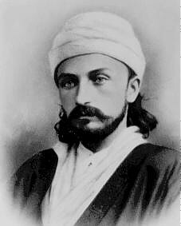

## Turn to your neighbour

::: {.incremental}
- With the person next to you try to remember what you read this week
- What did Bahá'u'lláh say in these paragraphs?
- What ideas stood out to you?
- Which parts did you not understand?
- What questions came up as you were reading?
:::

---

## Shoghi Effendi's Overview

::: {.tight .overview .fragment}
- Proclaims the existence and oneness of a personal God, unknowable, inaccessible, the source of
  all Revelation, eternal, omniscient, omnipresent and almighty
- Asserts the relativity of religious truth and the continuity of Divine Revelation
- Affirms the unity of the Prophets, the universality of their Message, the identity of their
  fundamental teachings, the sanctity of their scriptures, and the twofold character of their stations
- **Denounces the blindness and perversity of the divines and doctors of every age**
- **Cites and elucidates the allegorical passages of the New Testament, the abstruse verses of the
  Qur'án, and the cryptic Muḥammadan traditions which have bred those age-long misunderstandings, doubts and animosities that have sundered and kept apart the followers of the world’s leading religious systems**
- Enumerates the essential prerequisites for the attainment by every true seeker of the object
  of his quest
- Demonstrates the validity, the sublimity and significance of the Báb's Revelation
- Unfolds the meaning of such symbolic terms as "Return," "Resurrection," "Seal of the Prophets"
  and "Day of Judgment"
- Distinguishes between the three stages of Divine Revelation
- Expatiates upon the glories and wonders of the "City of God"
:::

::: {.tiny}
Shoghi Effendi, *God Passes By* — the two in bold are where this week's reading takes us.
:::

---

## Two themes this week

::: {.tiles .two}
::: {.tile .marked}
[Reasons for the Denial of the Prophets]{.tile-name}
[Paragraphs 8 and 13]{.tile-epithet}

- Every Manifestation has been met with **denial, strife and cruelty**
- Yet each was **foretold**, and the signs of His coming recorded
- The tests are deliberate: that **light may be distinguished from darkness**, and roses from thorns
- Nine times in these pages we are asked to **consider, ponder, reflect** on why
:::

::: {.tile .marked}
[The Meaning of Symbolic Terms]{.tile-name}
[Paragraphs 28–48]{.tile-epithet}

- The people awaited a sky that splits and an earth made new — Bahá'u'lláh reads these as **symbols**
- **Oppression**: not the sword, but a soul seeking truth with nowhere to turn
- **Sun, moon and stars**: the Prophets, the divines who follow them, and the laws of a Dispensation
- **Cleaving of the heaven**: an established Revelation set aside at the appearance of one soul
:::
:::

---

## Story Corner

::: {.slide-sub}
ʻAbdu'l-Bahá
:::

::: {.figure-slide}
::: {.fs-body .fs-prose}
::: {.fragment}
ʻAbdu'l-Bahá could always tell what was in a person's heart, and He greatly loved people whose
hearts were pure and radiant. There was a lady who had the honor of being the guest of
ʻAbdu'l-Bahá at dinner. As she sat listening to His words of wisdom, she looked at a glass of
water in front of her and thought, "Oh! If only ʻAbdu'l-Bahá would take my heart and empty it of
every earthly desire and then refill it with Divine love and understanding, just as you would do
with this glass of water."
:::

::: {.fragment}
This thought passed through her mind quickly, and she did not say anything about it, but soon
something happened that made her realize ʻAbdu'l-Bahá had known what she was thinking. While He
was in the middle of His talk, He paused to call over an attendant and said a few words to him
softly. The attendant quietly came to the lady's place at the table, took her glass, emptied it,
and put it back in front of her.
:::

::: {.fragment}
A little later, ʻAbdu'l-Bahá, while continuing to talk, picked up a pitcher of water from the
table, and in a most natural way, slowly refilled the lady's empty glass. No one noticed what had
happened, but the lady knew that ʻAbdu'l-Bahá was answering her heart's desire. She was filled
with joy. Now she knew that hearts and minds were like open books to ʻAbdu'l-Bahá, Who read them
with great love and kindliness.
:::
:::

::: {.fs-portrait}

:::
:::
