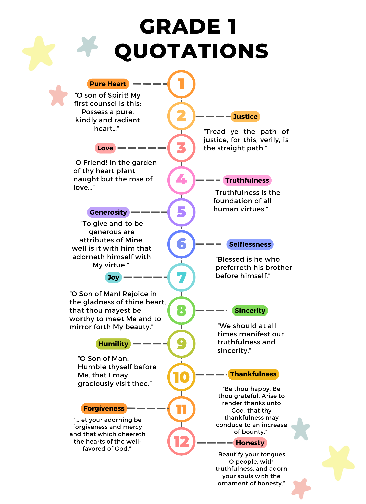
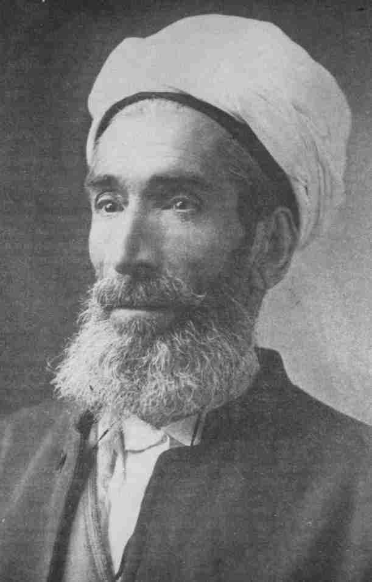
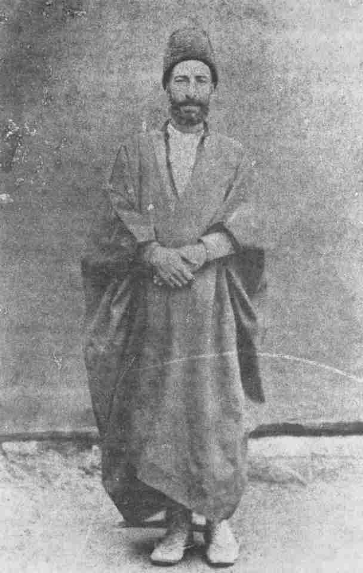

## Turn to your neighbour

::: {.incremental}
- With the person next to you try to remember what you read this week
- What did Bahá'u'lláh say in these paragraphs?
- What ideas stood out to you?
- Which parts did you not understand?
- What questions came up as you were reading?
:::

---

## Shoghi Effendi's Overview

::: {.tight .overview .fragment}
- Proclaims the existence and oneness of a personal God, unknowable, inaccessible, the source of
  all Revelation, eternal, omniscient, omnipresent and almighty
- Asserts the relativity of religious truth and the continuity of Divine Revelation
- Affirms the unity of the Prophets, the universality of their Message, the identity of their
  fundamental teachings, the sanctity of their scriptures, and the twofold character of their stations
- **Denounces the blindness and perversity of the divines and doctors of every age**
- **Cites and elucidates the allegorical passages of the New Testament, the abstruse verses of the
  Qur'án, and the cryptic Muḥammadan traditions which have bred those age-long misunderstandings, doubts and animosities that have sundered and kept apart the followers of the world’s leading religious systems**
- Enumerates the essential prerequisites for the attainment by every true seeker of the object
  of his quest
- Demonstrates the validity, the sublimity and significance of the Báb's Revelation
- Unfolds the meaning of such symbolic terms as "Return," "Resurrection," "Seal of the Prophets"
  and "Day of Judgment"
- Distinguishes between the three stages of Divine Revelation
- Expatiates upon the glories and wonders of the "City of God"
:::

::: {.tiny}
Shoghi Effendi, *God Passes By* — the two in bold are where this week's reading takes us.
:::

---

## Two themes this week

::: {.tiles .two}
::: {.tile .marked}
[Reasons for the Denial of the Prophets]{.tile-name}
[Paragraphs 8 and 13]{.tile-epithet}

- Every Manifestation has been met with **denial, strife and cruelty**
- Yet each was **foretold**, and the signs of His coming recorded
- The tests are deliberate: that **light may be distinguished from darkness**, and roses from thorns
- Nine times in these pages we are asked to **consider, ponder, reflect** on why
:::

::: {.tile .marked}
[The Meaning of Symbolic Terms]{.tile-name}
[Paragraphs 28–48]{.tile-epithet}

- The people awaited a sky that splits and an earth made new — Bahá'u'lláh reads these as **symbols**
- **Oppression**: not the sword, but a soul seeking truth with nowhere to turn
- **Sun, moon and stars**: the Prophets, the divines who follow them, and the laws of a Dispensation
- **Cleaving of the heaven**: an established Revelation set aside at the appearance of one soul
:::
:::

---

## Story Corner

::: {.slide-sub}
Purity of heart
:::

::: {.figure-slide}
::: {.fs-body .fs-narrow}
::: {.incremental}
- Purity of heart has come up a few times already in our study
- In the opening passage Bahá'u'lláh asked us to cleanse our "hearts from worldly affections"
- In this week's reading He asks us to seek, "with a humble mind from the Manifestations of God
  … the true meaning of these words", and to acquire "true knowledge from its very Source"
- The capacity to recognize God seems bound up with purifying ourselves of attachment to earthly
  things and to literal interpretations, and with turning to the Source for truth
- No wonder that an individual's first encounter with the institute process is on the subject of
  purity of heart
:::

::: {.tiny}
Kitáb-i-Íqán ¶2, ¶26 and ¶42.
:::
:::

::: {.fs-portrait}

:::
:::

---

## Story Corner

::: {.slide-sub}
ʻAbdu'l-Bahá
:::

::: {.figure-slide}
::: {.fs-body .fs-prose}
::: {.fragment}
ʻAbdu'l-Bahá could always tell what was in a person's heart, and He greatly loved people whose
hearts were pure and radiant. There was a lady who had the honor of being the guest of
ʻAbdu'l-Bahá at dinner. As she sat listening to His words of wisdom, she looked at a glass of
water in front of her and thought, "Oh! If only ʻAbdu'l-Bahá would take my heart and empty it of
every earthly desire and then refill it with Divine love and understanding, just as you would do
with this glass of water."
:::

::: {.fragment}
This thought passed through her mind quickly, and she did not say anything about it, but soon
something happened that made her realize ʻAbdu'l-Bahá had known what she was thinking. While He
was in the middle of His talk, He paused to call over an attendant and said a few words to him
softly. The attendant quietly came to the lady's place at the table, took her glass, emptied it,
and put it back in front of her.
:::

::: {.fragment}
A little later, ʻAbdu'l-Bahá, while continuing to talk, picked up a pitcher of water from the
table, and in a most natural way, slowly refilled the lady's empty glass. No one noticed what had
happened, but the lady knew that ʻAbdu'l-Bahá was answering her heart's desire. She was filled
with joy. Now she knew that hearts and minds were like open books to ʻAbdu'l-Bahá, Who read them
with great love and kindliness.
:::
:::

::: {.fs-portrait}

:::
:::

---

## Story Corner

::: {.slide-sub}
Mírzá Abu'l-Faḍl
:::

::: {.figure-slide}
::: {.fs-body .incremental}
- Born June 1844 in a village near Gulpáygán, Iran
- Died 21 January 1914 in Cairo, Egypt
- Trained in the Islámic sciences and appointed head of the Madrisiy-i-Ḥakím Háshim in Ṭihrán
- Declared his belief on 20 September 1876, and was imprisoned three times in the years that
  followed
- Named one of the Apostles of Bahá'u'lláh by Shoghi Effendi, who called him "the learned
  apologist" and the pre-eminent scholar of the Faith
- Taught across Persia, Central Asia and Egypt — some thirty believers at al-Azhar — and in
  America from 1901 to 1904
- Wrote *Faṣlu'l-Khiṭáb* (1892), *The Bahá'í Proofs* (1902) and *The Brilliant Proof* (1912)
:::

::: {.fs-portrait}

:::
:::

---

## Story Corner

::: {.slide-sub}
Ustád Ḥusayn-i-Naʻl-Band
:::

::: {.figure-slide}
::: {.fs-body .fs-prose .fs-tight}
::: {.fragment}
One Friday afternoon, Mírzá Abu'l-Faḍl, in company with a few Mullás, left the city to visit a
certain shrine in the countryside in the vicinity of the capital. They were all riding on donkeys.
It was customary in those days for the people to leave the city for nearby villages on Fridays
(which is a public holiday in Islámic countries) for pleasure as well as visiting holy places.
:::

::: {.fragment}
It so happened that on the way out one of the donkeys lost a shoe, so the party called at the
nearest blacksmith for help. Noticing the long beard and large turban of Mírzá Abu'l-Faḍl —
indications of his vast knowledge — the blacksmith Ustád Ḥusayn-i-Naʻl-Band (shoeing smith), who
was illiterate, was tempted to enter into conversation with the learned man. He said to Mírzá that
since he had honoured him with his presence, it would be a great privilege for him if he could be
allowed to ask a question which had perplexed his mind for some time.
:::

::: {.fragment}
When permission was granted he said, 'Is it true that in the Traditions of Shíʻah Islám it is
stated that each drop of rain is accompanied by an angel from heaven? And that this angel brings
down the rain to the ground?' 'This is true,' Mírzá Abu'l-Faḍl responded. After a pause, the
blacksmith begged to be allowed to ask another question to which Mírzá gave his assent. 'Is it
true', the blacksmith asked, 'that if there is a dog in a house no angel will ever visit that
house?' Before thinking of the connection between the two questions, Mírzá Abu'l-Faḍl responded in
the affirmative.
:::

::: {.fragment}
'In that case', commented the blacksmith, 'no rain should ever fall in a house where a dog is
kept.' Mírzá Abu'l-Faḍl, the noted learned man of Islám, was now confounded by an illiterate
blacksmith. His rage knew no bounds, and his companions noticed that he was filled with shame.
They whispered to him, 'This blacksmith is a Bahá'í!'
:::
:::

::: {.fs-portrait}

:::
:::

---

## Story Corner

::: {.slide-sub}
Mírzá Abu'l-Faḍl
:::

::: {.figure-slide}
::: {.fs-body .fs-narrow}
::: {.incremental}
- Mírzá Abu'l-Faḍl began meeting Bahá'ís such as Nabíl-i-Akbar
- He was not satisfied, and decided to turn to the Word of God as the source
- He read the Íqán with a sense of intellectual superiority, and thought that he could write a
  better book himself
- He came across Bahá'u'lláh's Tablet of Fu'ád, which he greatly enjoyed
:::

::: {.fragment .poem}
> Soon will We dismiss the one who was like unto him, and will lay hand on their Chief who ruleth
> the land, and I, verily, am the Almighty, the All-Compelling.

[Bahá'u'lláh, the Lawḥ-i-Fu'ád]{.poem-attrib}
:::

::: {.incremental}
- He was completely shocked, and thought that if Bahá'u'lláh could do this he would become a
  Bahá'í
- A few months later Sulṭán ʻAbdu'l-ʻAzíz was deposed and killed, and Mírzá Abu'l-Faḍl became a
  Bahá'í
:::
:::

::: {.fs-portrait}

:::
:::
