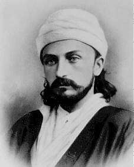

## Turn to your neighbour

::: {.incremental}
- With the person next to you try to remember what you read this week
- What did Bahá'u'lláh say in these paragraphs?
- What ideas stood out to you?
- Which parts did you not understand?
- What questions came up as you were reading?
:::

---

## Shoghi Effendi's Overview

::: {.tight .overview .fragment}
- Proclaims the existence and oneness of a personal God, unknowable, inaccessible, the source of
  all Revelation, eternal, omniscient, omnipresent and almighty
- Asserts the relativity of religious truth and the continuity of Divine Revelation
- **Affirms the unity of the Prophets, the universality of their Message, the identity of their
  fundamental teachings, the sanctity of their scriptures, and the twofold character of their stations**
- Denounces the blindness and perversity of the divines and doctors of every age
- **Cites and elucidates the allegorical passages of the New Testament, the abstruse verses of the
  Qur'án, and the cryptic Muḥammadan traditions which have bred those age-long misunderstandings, doubts and animosities that have sundered and kept apart the followers of the world’s leading religious systems**
- Enumerates the essential prerequisites for the attainment by every true seeker of the object
  of his quest
- Demonstrates the validity, the sublimity and significance of the Báb's Revelation
- Unfolds the meaning of such symbolic terms as "Return," "Resurrection," "Seal of the Prophets"
  and "Day of Judgment"
- Distinguishes between the three stages of Divine Revelation
- Expatiates upon the glories and wonders of the "City of God"
:::

::: {.tiny}
Shoghi Effendi, *God Passes By* — the two in bold are where this week's reading takes us.
:::

---

## Two themes this week

::: {.tiles .two}
::: {.tile .marked}
[The Purpose of Tests]{.tile-name}
[Paragraphs 53–63]{.tile-epithet}

- The symbolic language and the unexpected events are both there **to test and prove** us
- And so that souls may **develop**, "delivered from the prison-cage of self and desire"
- The Qiblih turned mid-prayer, and companions of the Prophet **turned on their heels**
- Moses the accused murderer; Jesus the fatherless child
- "Contrary are the ways of the Manifestations of God … to the ways and desires of men"
:::

::: {.tile .marked}
[Symbolic Terms, Continued]{.tile-name}
[Paragraphs 51–52, 66–73]{.tile-epithet}

- **Earth**: the soil of the human heart, changed into "another earth"
- **Heaven**: divine Revelation — the old folded up, a new one raised and adorned
- **The sign of the Son of man**: a star in the *visible* heaven
- And in the *invisible* heaven, a **herald**: Yaḥyá, Salmán's four, then Aḥmad and Káẓim
- Every Manifestation announced **twice over**
:::
:::

---

## Intelligible Realities

::: {.slide-sub}
and their expression through sensible forms
:::

::: {.figure-slide}
::: {.fs-body .fs-prose .fs-tight}
::: {.fragment}
There is a point that is pivotal to grasping the essence of the other questions that we have
discussed or will be discussing, namely, that human knowledge is of two kinds.
:::

::: {.fragment}
One is the knowledge acquired through the senses. That which the eye, the ear, or the senses of
smell, taste, or touch can perceive is called "sensible". For example, the sun is sensible, as it
can be seen. Likewise, sounds are sensible, as the ear can hear them; odours, as they can be
inhaled and perceived by the sense of smell; foods, as the palate can perceive their sweetness,
sourness, bitterness, or saltiness; heat and cold, as the sense of touch can perceive them. These
are called sensible realities.
:::

::: {.fragment}
The other kind of human knowledge is that of intelligible things; that is, it consists of
intelligible realities which have no outward form or place and which are not sensible. For
example, the power of the mind is not sensible, nor are any of the human attributes: These are
intelligible realities. Love, likewise, is an intelligible and not a sensible reality. For the ear
does not hear these realities, the eye does not see them, the smell does not sense them, the taste
does not detect them, the touch does not perceive them. Even the ether, the forces of which are
said in natural philosophy to be heat, light, electricity, and magnetism, is an intelligible and
not a sensible reality. Likewise, nature itself is an intelligible and not a sensible reality; the
human spirit is an intelligible and not a sensible reality.
:::
:::

::: {.fs-portrait}

:::
:::

---

## Intelligible Realities

::: {.slide-sub}
and their expression through sensible forms
:::

::: {.figure-slide}
::: {.fs-body .fs-prose}
::: {.fragment}
But when you undertake to express these intelligible realities, you have no recourse but to cast
them in the mould of the sensible, for outwardly there is nothing beyond the sensible. Thus, when
you wish to express the reality of the spirit and its conditions and degrees, you are obliged to
describe them in terms of sensible things, since outwardly there exists nothing but the sensible.
:::

::: {.fragment}
For example, grief and happiness are intelligible things, but when you wish to express these
spiritual conditions you say, "My heart became heavy", or "My heart was uplifted", although one's
heart is not literally made heavy or lifted up. Rather, it is a spiritual or intelligible
condition, the expression of which requires the use of sensible terms.
:::

::: {.fragment}
Another example is when you say, "So-and-so has greatly advanced", although he has remained in the
same place, or "So-and-so has a high position", whereas, like everyone else, he continues to walk
upon the earth. This elevation and advancement are spiritual conditions and intelligible
realities, but to express them you must use sensible terms, since outwardly there is nothing
beyond the sensible.
:::

::: {.tiny}
ʻAbdu'l-Bahá, *Some Answered Questions*, ch. 16.
:::
:::

::: {.fs-portrait}

:::
:::
