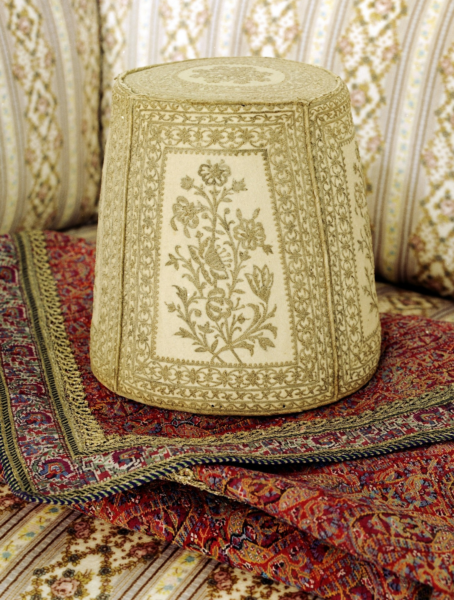
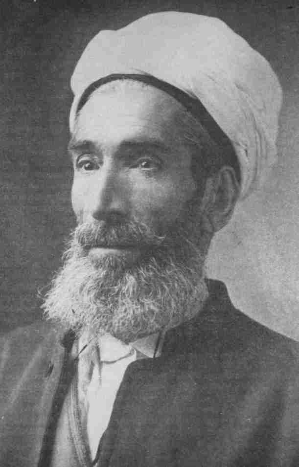

## A thought on understanding the Íqán

::: {.poem}
> We speak one word, and by it we intend one and seventy meanings; each one of these meanings we
> can explain.

[A tradition quoted in the Kitáb-i-Íqán ¶283]{.poem-attrib}
:::

::: {.fs-body .fragment}
- Many statements of Bahá'u'lláh can be understood in at least three ways. Let's take the idea of
  not using the words and deeds of mortal men as a standard for the recognition of God, which was
  introduced at the beginning of the Íqán
:::

::: {.tiles}
::: {.tile .marked .fragment}
[The Íqán in the past]{.tile-name}
[The historical context]{.tile-epithet}

- Read in its setting: the clergy and divines of 19th-century Persia and the Ottoman Empire
- The uncle of the Báb, held back by what the divines of his day said the traditions meant
:::

::: {.tile .marked .fragment}
[The Íqán in the present]{.tile-name}
[Universal truths]{.tile-epithet}

- True for us now, though our context is very different
- What standard am I using today?
- What does my own process of recognition look like?
:::

::: {.tile .marked .fragment}
[The Íqán in the future]{.tile-name}
[The society we are building]{.tile-epithet}

- What if everyone could purify their heart and investigate reality for themselves?
- What structures and systems would each neighbourhood need?
:::
:::

---

## A thought on understanding the Íqán

::: {.fs-body}
- The stories of the Prophets can be read on the same three levels
:::

::: {.tiles}
::: {.tile .marked .fragment}
[In the past]{.tile-name}
[History]{.tile-epithet}

- The stories as historical accounts
- Noah, Moses, Jesus and Muḥammad, and how their people received them
:::

::: {.tile .marked .fragment}
[In the present]{.tile-name}
[Principle]{.tile-epithet}

- Why were the Prophets denied?
- The universal principles behind those denials, as true today as then
:::

::: {.tile .marked .fragment}
[In the future]{.tile-name}
[Vision]{.tile-epithet}

- A society that recognizes the fundamental unity of the Prophets
- The barriers between religious communities removed
:::
:::

---

## An observation on Bahá'u'lláh's approach

::: {.tiles .two}
::: {.tile .marked .fragment}
1. Muḥammad is the fulfilment of the Bible
2. If Muḥammad is the fulfilment of the Bible, then the Bible must be interpreted symbolically
3. **Therefore the Bible must be interpreted symbolically**
:::

::: {.tile .marked .fragment}
1. The verses of the Bible must be interpreted symbolically
2. If the verses of the Bible must be interpreted symbolically, then the verses of the Qur'án must
   be interpreted symbolically
3. **Therefore the verses of the Qur'án must be interpreted symbolically**
:::
:::

::: {.fs-body .fragment .observation-close}
When understood symbolically, the verses of the Qur'án are fulfilled by the Revelation of the Báb.
:::

---

## This week's paragraphs

::: {.tiles .two .outline}
::: {.tile}
- Meaning of 'heaven' — ¶74–5
  - Inner state of the Manifestations — ¶74
  - Many diverse applications: various heavens — ¶75
- Two kinds of knowledge — ¶76
- Heart must be cleansed from idle sayings — ¶77
- Meaning of 'clouds' — ¶79–83
- Meaning of 'smoke' — ¶84
- Meaning of 'angels' — ¶86–7
- Objections and differences persist in every age — ¶88–90
:::

::: {.tile}
- Alleged corruption of the Texts — ¶91–8
  - Story of Ibn-i-Súríyá on penalty for adultery — ¶92
  - Distortion after hearing the Word — ¶94
  - Meaning of 'corruption' — ¶93–4
  - Supposed non-existence of genuine Gospel — ¶98
- 'Everlasting Morn is breaking' — ¶99
- Three degrees of perception of Truth: 'holy realm of the spirit', 'sacred domain of truth' and
  'land of testimony' — ¶100
- Exhortation to the people of the Bayán — ¶101
- Consummation of all things is belief in the Promised One — ¶101
:::
:::

::: {.tiny}
Hooper Dunbar, *A Companion to the Study of the Kitáb-i-Íqán*, "A Sequential Outline of the Text", pp. 56–57.
:::

---

## The Clouds of Heaven

::: {.slide-sub}
Bahá'u'lláh
:::

::: {.figure-slide}
::: {.fs-body .fs-tight}
::: {.poem .fragment}
> By the term "clouds" is meant those things that are contrary to the ways and desires of men. …
> These "clouds" signify, in one sense, the annulment of laws, the abrogation of former
> Dispensations, the repeal of rituals and customs current amongst men, the exalting of the
> illiterate faithful above the learned opposers of the Faith. In another sense, they mean the
> appearance of that immortal Beauty in the image of mortal man, with such human limitations as
> eating and drinking, poverty and riches, glory and abasement, sleeping and waking, and such other
> things as cast doubt in the minds of men, and cause them to turn away. All such veils are
> symbolically referred to as "clouds."

[Bahá'u'lláh, Kitáb-i-Íqán ¶79]{.poem-attrib}
:::

::: {.incremental .clouds-echo}
- In Week 3 we read the reasons people gave for denying the Prophets
- "We see in thee but a man like ourselves" — said to **Noah**
- "Is not this Jesus, the son of Joseph, whose father and mother we know? how is it then that he
  saith, I came down from heaven?" — said of **Jesus**
- "What manner of apostle is this? He eateth food, and walketh the streets" — said of **Muḥammad**
- Bahá'u'lláh's answer: "These ancient Beings, though delivered from the womb of their mother,
  have in reality descended from the heaven of the will of God"
:::

::: {.tiny}
Qur'án 11:27 · John 6:42 · Qur'án 25:7 · Kitáb-i-Íqán ¶74 and ¶80.
:::
:::

::: {.fs-portrait}

:::
:::

---

## The Corruption of the Text

::: {.tiles .two}
::: {.tile}
[What it is not]{.tile-name}
[Paragraphs 91–93, 98]{.tile-epithet}

- Jewish and Christian divines secretly **erasing** verses about Muḥammad
- "Can a man who believeth in a book, and deemeth it to be inspired by God, mutilate it?"
- The Pentateuch was "spread over the surface of the earth", not kept in Mecca and Medina
- The true Gospel taken up into heaven, leaving its people with nothing to cling to
:::

::: {.tile .marked}
[What it is]{.tile-name}
[Paragraphs 93–94]{.tile-epithet}

- "The interpretation of God's holy Book in accordance with their idle imaginings and vain desires"
- "The meaning of the Word of God hath been perverted, not that the actual words have been effaced"
- What the Muslim divines of Bahá'u'lláh's day were doing with the Qur'án
- A danger for every reader of every Book, ourselves included
:::
:::

---

## Two Kinds of Knowledge

::: {.tiles .two}
::: {.tile .marked}
[Divine]{.tile-name}
[Paragraph 76]{.tile-epithet}

- **Source**: God Himself, "the fountain of divine inspiration"
- **Principle**: "Fear ye God; God will teach you"
- **Fruit**: patience, longing desire, true understanding, and love
:::

::: {.tile}
[Satanic]{.tile-name}
[Paragraph 76]{.tile-epithet}

- **Source**: "the whisperings of selfish desire", "vain and obscure thoughts"
- **Principle**: "Knowledge is the most grievous veil between man and his Creator"
- **Fruit**: arrogance, vainglory and conceit; hatred and envy
:::
:::

::: {.fragment .poem}
> The heart must needs therefore be cleansed from the idle sayings of men, and sanctified from
> every earthly affection, so that it may discover the hidden meaning of divine inspiration.

[Kitáb-i-Íqán ¶77]{.poem-attrib}
:::

---

## Knowledge is as wings

::: {.slide-sub}
Bahá'u'lláh and ʻAbdu'l-Bahá
:::

::: {.figure-slide}
::: {.fs-body .fs-lg}
::: {.fragment}
Knowledge is as wings to man's life, and a ladder for his ascent. Its acquisition is incumbent
upon everyone. The knowledge of such sciences, however, should be acquired as can profit the
peoples of the earth, and not those which begin with words and end with words.
:::

::: {.fragment}
Religion and science are the two wings upon which man's intelligence can soar into the heights,
with which the human soul can progress.
:::

::: {.tiny}
Bahá'u'lláh, Tajallíyát, in *Tablets of Bahá'u'lláh*; ʻAbdu'l-Bahá, *Paris Talks*, 44.
:::
:::

::: {.fs-portrait}

:::
:::

---

## The Proof is His Word

::: {.slide-sub}
Bahá'u'lláh
:::

::: {.figure-slide}
::: {.fs-body .fs-md}
::: {.fragment}
O affectionate seeker! Shouldst thou soar in the holy realm of the spirit, thou wouldst recognize
God manifest and exalted above all things, in such wise that thine eyes would behold none else but
Him. … So lofty is this station that no testimony can bear it witness, neither evidence do justice
to its truth.
:::

::: {.fragment}
And if thou dwellest in the land of testimony, content thyself with that which He, Himself, hath
revealed: "Is it not enough for them that We have sent down unto Thee the Book?" This is the
testimony which He, Himself, hath ordained; greater proof than this there is none, nor ever will
be: "This proof is His Word; His own Self, the testimony of His truth."

[Kitáb-i-Íqán ¶100]{.poem-attrib .proof-attrib}
:::

:::

::: {.fs-portrait}

:::
:::

---

## The Proof is His Word

::: {.slide-sub}
Mírzá Abu'l-Faḍl
:::

::: {.figure-slide}
::: {.fs-body .fs-md}
::: {.fragment}
It is obvious that any evidence or proof must be related to the thing for which the evidence or
proof is presented. Otherwise, it cannot be considered proof or evidence — no matter how
astonishing or amazing.
:::

::: {.fragment}
For instance, let us say someone claims to be a physician, learned in the arts of preserving health
and treating ailments. Let us further say that he presents as proof of the soundness of this claim
his ability to fly. Now, even should he do this, his flight does not necessarily constitute
evidence that he is a physician, though it would certainly be an amazing and astonishing feat.
:::

::: {.fragment}
For flight is not among the attributes of the skill in question: there is no link between it and
the science of medicine. Rather, preserving health and releasing the ailing from diseases are the
attributes of this skill and constitute evidence related to the soundness of this claim and the
truth of this assertion.

[Mírzá Abu'l-Faḍl, *Miracles and Metaphors*, pp. 104–105]{.poem-attrib .proof-attrib}
:::
:::

::: {.fs-portrait}

:::
:::

---

## The Proof is His Word

::: {.slide-sub}
Bahá'u'lláh
:::

::: {.figure-slide}
::: {.fs-body .fs-md}
::: {.fragment}
Say: The first and foremost testimony establishing His truth is His own Self. Next to this
testimony is His Revelation. For whoso faileth to recognize either the one or the other He hath
established the words He hath revealed as proof of His reality and truth. This is, verily, an
evidence of His tender mercy unto men. He hath endowed every soul with the capacity to recognize
the signs of God. How could He, otherwise, have fulfilled His testimony unto men, if ye be of them
that ponder His Cause in their hearts. He will never deal unjustly with anyone, neither will He task
a soul beyond its power. He, verily, is the Compassionate, the All-Merciful.

Say: So great is the glory of the Cause of God that even the blind can perceive it, how much more
they whose sight is sharp, whose vision is pure. The blind, though unable to perceive the light of
the sun, are, nevertheless, capable of experiencing its continual heat.

[*Gleanings from the Writings of Bahá'u'lláh*, LII]{.poem-attrib .proof-attrib}
:::
:::

::: {.fs-portrait}

:::
:::

---

## Story Corner

::: {.slide-sub}
ʻAbdu'l-Bahá and the Artist
:::

::: {.figure-slide}
::: {.fs-body .fs-prose .fs-tight}
::: {.fragment}
One evening at the home of Monsieur and Madame Dreyfus-Barney, an artist was presented to ʻAbdu'l-Bahá.
:::

::: {.fragment}
"Thou art very welcome. I am happy to see thee. All true art is a gift of the Holy Spirit."
:::

::: {.fragment}
"What is the Holy Spirit?"
:::

::: {.fragment}
"It is the Sun of Truth, O Artist!"
:::

::: {.fragment}
"Where, O where, is the Sun of Truth?"
:::

::: {.fragment}
"The Sun of Truth is everywhere. It is shining on the whole world."
:::

::: {.fragment}
"What of the dark night, when the Sun is not shining?"
:::

::: {.fragment}
"The darkness of night is past, the Sun has risen."
:::

::: {.fragment}
"But, Master! how shall it be with the blinded eyes that cannot see the Sun's splendor? And what of the deaf ears that cannot hear those who praise its beauty?"
:::

::: {.fragment}
"I will pray that the blind eyes may be opened, that the deaf ears may be unstopped, and that the hearts may have grace to understand."
:::

::: {.fragment}
As ʻAbdu'l-Bahá spoke, the troubled mien of the Artist gave place to a look of relief, satisfied understanding, joyous emotion.
:::

:::

::: {.fs-portrait}

:::
:::

---

## Shoghi Effendi's Overview

::: {.tight .overview .fragment}
- Proclaims the existence and oneness of a personal God, unknowable, inaccessible, the source of
  all Revelation, eternal, omniscient, omnipresent and almighty
- Asserts the relativity of religious truth and the continuity of Divine Revelation
- **Affirms the unity of the Prophets, the universality of their Message, the identity of their
  fundamental teachings, the sanctity of their scriptures, and the twofold character of their stations**
- **Denounces the blindness and perversity of the divines and doctors of every age**
- **Cites and elucidates the allegorical passages of the New Testament, the abstruse verses of the
  Qur'án, and the cryptic Muḥammadan traditions which have bred those age-long misunderstandings, doubts and animosities that have sundered and kept apart the followers of the world’s leading religious systems**
- **Enumerates the essential prerequisites for the attainment by every true seeker of the object
  of his quest**
- Demonstrates the validity, the sublimity and significance of the Báb's Revelation
- Unfolds the meaning of such symbolic terms as "Return," "Resurrection," "Seal of the Prophets"
  and "Day of Judgment"
- Distinguishes between the three stages of Divine Revelation
- Expatiates upon the glories and wonders of the "City of God"
:::

::: {.tiny}
Shoghi Effendi, *God Passes By* — the four in bold are where this week's reading takes us.
:::

---

## Turn to your neighbour

::: {.incremental}
- With the person next to you try to remember what you read this week
- What did Bahá'u'lláh say in these paragraphs?
- What ideas stood out to you?
- Which parts did you not understand?
- What questions came up as you were reading?
:::
